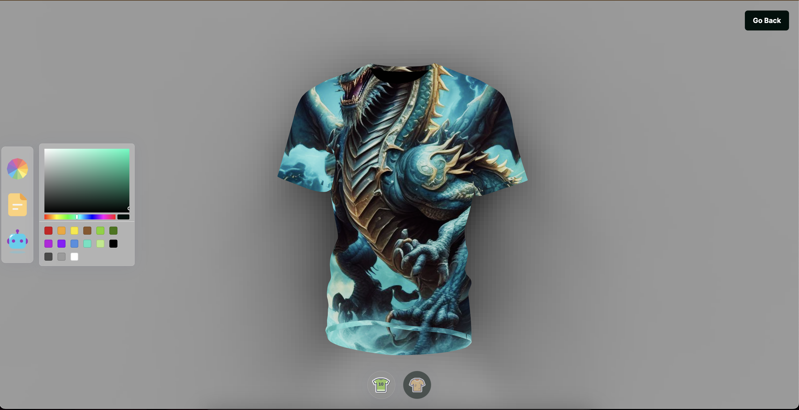

# 3D T-shirt Customizer 🎨👕

A **3D T-shirt Customizer** web application that allows users to personalize a 3D T-shirt model by changing colors, adding logos, and generating unique textures using AI (DALL·E API). This app provides a smooth and interactive experience using **React**, **Three.js**, and **Framer Motion**.

---

## ✨ Features

- Customize a 3D T-shirt model with different colors.
- Upload your own logo or pattern.
- Generate AI-powered designs using DALL·E.
- Download customized T-shirt images.
- Smooth animations using Framer Motion.
- Responsive design for both desktop and mobile.

---

## 🛠 Tech Stack

- **Frontend**: React, Three.js, TailwindCSS, Framer Motion
- **Backend**: Node.js, Express
- **AI Integration**: OpenAI DALL·E API
- **State Management**: Valtio
- **Version Control**: Git & GitHub
